# Scatterbrained Studio — Screen Compositions

The screen inventory after the UX redesign (rail + palette + lens shell). Each shot is
a real capture of the running app at a **full desktop viewport (1440 × 900, 2× DPR)**,
driven through the actual UI (`docs/capture-screens.mjs`) **against the demo graph**
(`examples/seed-demo.cypher` — never real data; these images feed the public site).

> **Design frame.** The product thesis is **See → Understand → Act**, realized as *one
> workspace with many coordinated lenses* — not five separate apps. The same tested
> components render at different **altitudes** (glance → inspect → report), and every
> surface draws from one token layer (`public/styles/tokens.css` — see SPEC.md §11), so
> these screens are modes of one surface, not different screens.

Personas referenced: **P1 Alex / Operator**, **P2 Maya / Co-op Developer**,
**P3 Dr. Okafor / Researcher**, **P4 Sam / Second-Brain (non-technical)**,
**P5 Lena / Strategist**.

---

## The shell — rail, ask-bar, dock (every screen shares it)

- **Mode rail** (left edge, 64 px, always labeled — never icon-only): the four lenses
  **Graph · Time · Code · Agents** on top (shortcuts `G T C A`), the utilities
  **Capture (+) · Help (?) · Settings** below. "Where am I" is always answered by the
  lit rail item; every lens overlay carries the same `lens-head` (‹ Graph · eyebrow ·
  tabs · esc hint) and one ordered **Esc stack** unwinds layer by layer.
- **Ask-bar + command palette** (`⌘K` or `/`): one input, three lanes — **Commands**
  (the closed registry in `lib/commands.js`: lenses, capture, filters, appearance,
  UI size, tour), **Answers** (intents: blocked / due / changed / needs review …) and
  **Memories** (search). Rows teach their shortcuts.
- **Dock** (the cockpit): resume card with the **Daily Brief**, lens chips + type
  filter, then Goals / Due / What's new / Needs review sections.
- Navigation state lives in `location.hash` (`#time/agenda`, `#code/review`, …) via
  `lib/nav.js` — every lens+tab is deep-linkable and survives reload.

## 1. Overview — the constellation (home base)

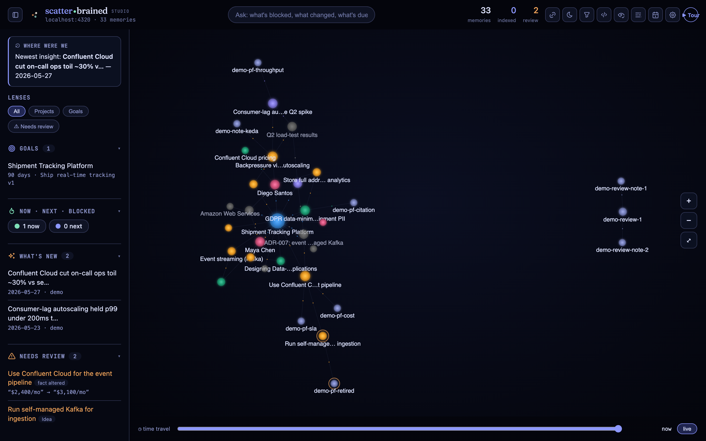

**Persona.** P1 primarily; the shared entry point for everyone.

**Usefulness.** Answers *"what is my whole knowledge landscape, and what's alive in it
right now?"* at a glance. Labels are decluttered per-frame; the dock turns the star-map
into mission-control. The chrome is **glass** (backdrop-blur over the constellation,
`@supports`-gated, disabled under calm/anim-off), so the graph reads as the room the
panels sit in rather than a backdrop behind walls.

**Daily Brief.** On the day's first open the resume card leads with a serif one-liner —
*N new insights · N due · N blocked, since your last visit* — and three actions: **pick
up where you left off** (last focused node, persisted), **see what's due** (Time lens),
**review queue** (needs-review filter). The first action is the primary CTA and carries
the app's one `--glow`. Dismissable; returns tomorrow.

**Critique.** The force layout still clusters center-left (no d3 collision force in the
vendored build). The dock and the palette both answer "what needs me" — the redundancy
is now deliberate (glance vs. ask), but the dock sections could collapse further.

## 2. Command palette — ask, don't hunt

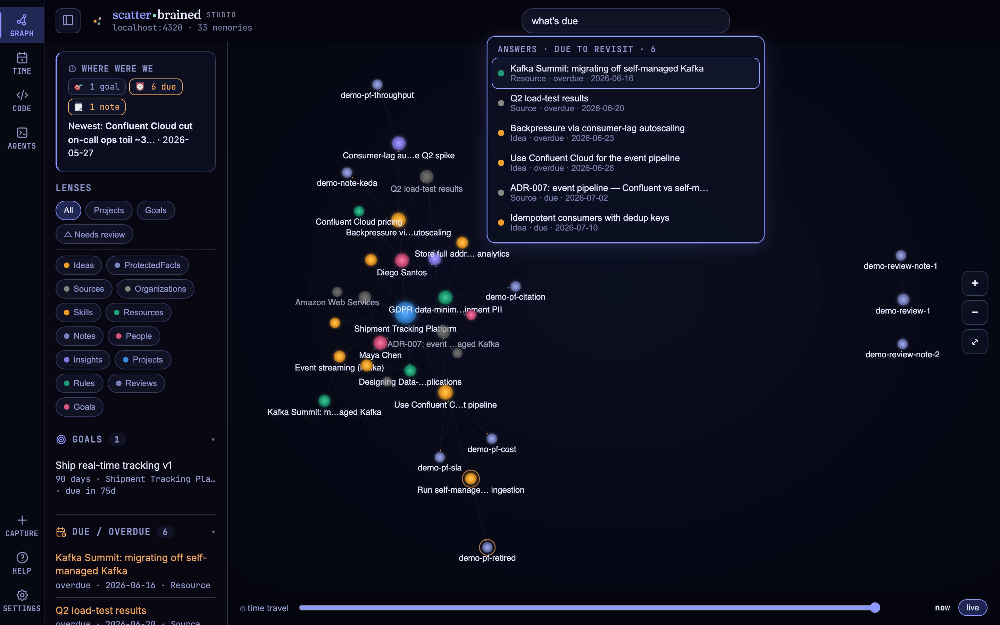

**Persona.** P1 (Operator) and P4 (no Cypher, ever).

**Usefulness.** Typing "what's due" returns an **answer list**, not highlighted
dots; typing "review" surfaces the *Open Code review* command with its shortcut;
anything else falls through to search with clickable results. Keyboard-first (↑/↓,
Enter, Esc). The focused bar + panel carry the `--glow` token — the one glowing thing
on screen, on purpose.

**Critique.** Search is still substring `CONTAINS`, not semantic — the embeddings on
nodes aren't wired into this path yet. Intent vocabulary is closed; a miss feels like a
dumb search box.

## 3. Inspector — the peek (single click)

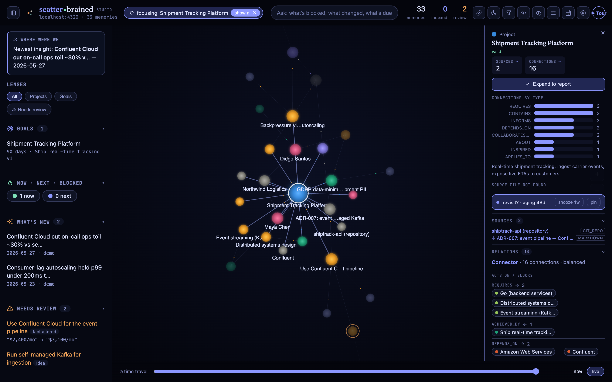

**Usefulness.** The panel is **composed**, not hand-coded: the tested resolver picks
components from the node's content-signals (key-facts, chart, excerpt, provenance,
relations, schedule…). Collapsible sections keep the 300 px rail honest; "Expand to
report" is the next altitude.

**Protected facts** (below): pinned figures a rewrite must honor — a pending change
lands here for approval, bi-temporally.

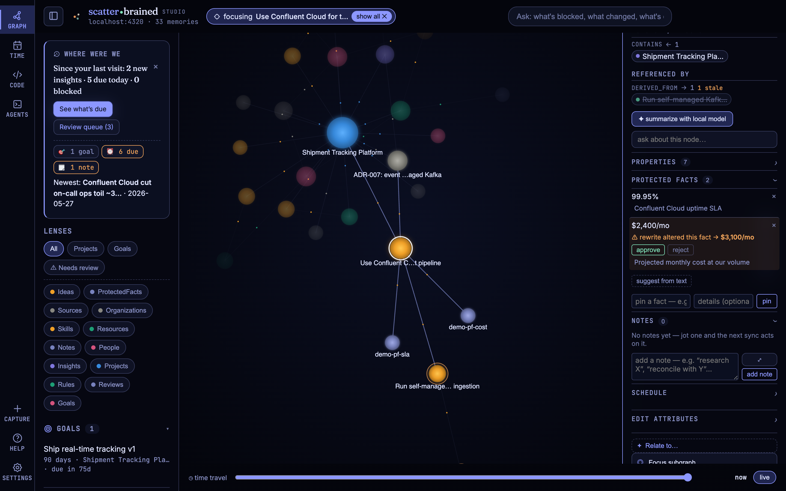

**Timeline**: superseded decisions stay walkable — `created → valid_until → superseded
by → reason`, with the successor a click away.

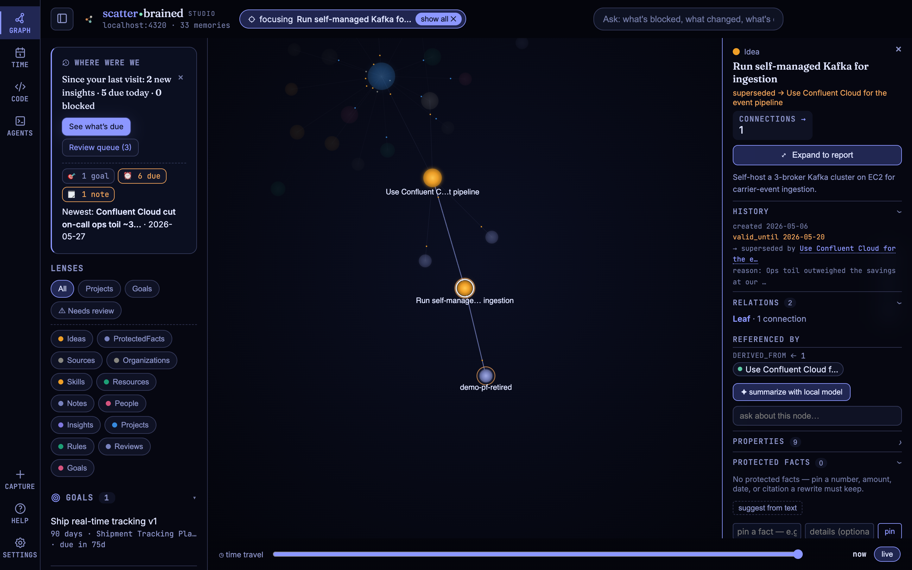

**Critique.** The peek still leans dense for a "glance" — chart + excerpt are arguably
report-altitude. Inline association (`Relate to…`, shot 9) is powerful but hidden
behind a toggle.

## 4. Report — the workspace (expand)

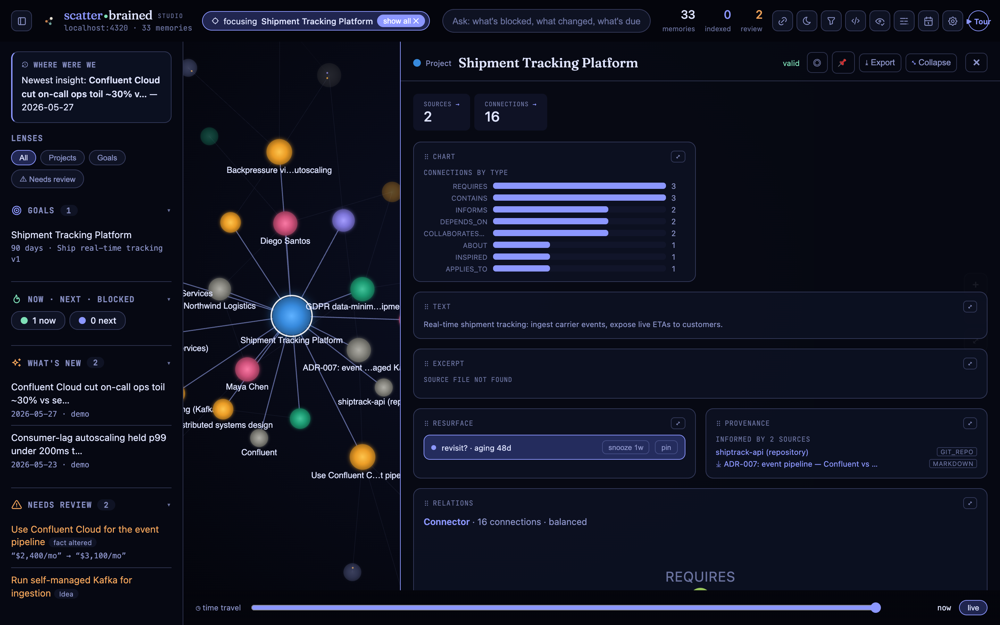

**Usefulness.** The *same* components render large on the one card recipe (eyebrow →
body → mono meta footer); Export produces a Markdown briefing of exactly what's on
screen. The graph stays live beside it. All component failure paths render the shared
empty-state — no bare "NOT FOUND" strings anywhere at this altitude.

**Critique.** The rigid 2-col grid leaves ragged whitespace next to short components;
wants a priority flow. Still read+export, not compose.

## 5. Time lens — Agenda · Quarters

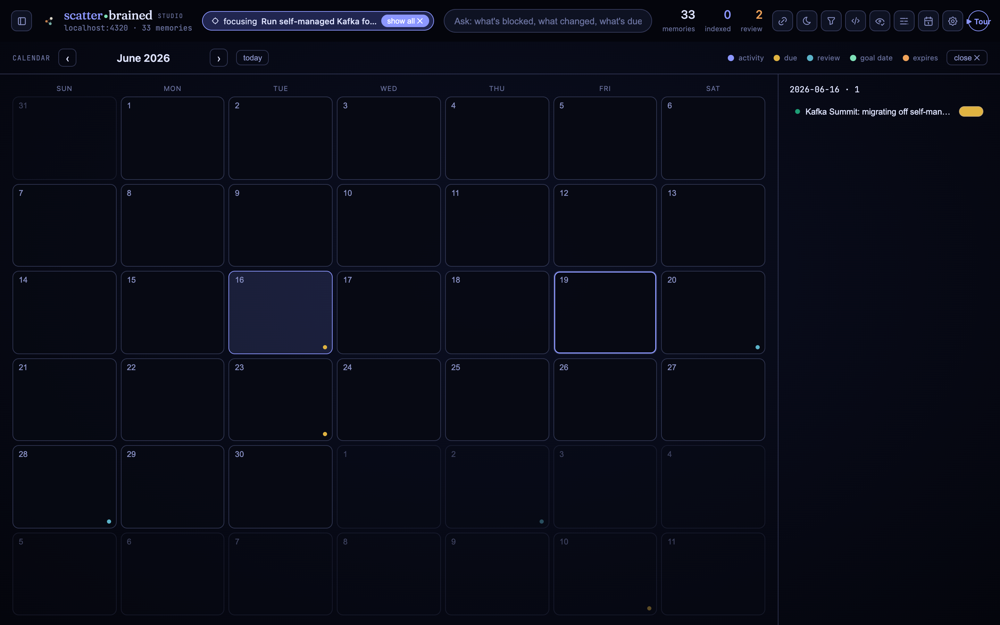

**Persona.** P1's "what should I do" and P5's quarter view.

**Usefulness.** The lens leads with **Agenda** — the digest buckets (Overdue / Today /
This week / Upcoming / To review) as cards, with a **clickable** mini-month heat +
created-per-day sparkline in the side column. Clicking a day cell filters the agenda to
that day (every kind, incl. created activity), with a clear ✕ chip above the list; Esc
clears the day-filter before it closes the lens. **Quarters** re-hosts the goals-roadmap
swimlanes. (The standalone **Month** grid was retired 2026-07-02 — two surfaces doing one
job; the mini-month absorbed it.) Empty agenda? The designed empty state offers per-goal
**set-a-date** on-ramps — the calendar earns data instead of begging for it.

**Critique.** Agenda rows open the inspector but can't *reschedule* inline yet.

## 6. Code lens — Map · Review

**Usefulness.** One lens, one shared repo picker. **Map** renders the module/import
graph of any granted repo; **Review** is graph-native code review — a `Review` node
pinned to a repo@commit, files frozen at that commit, line comments as `Note`s in the
graph, verdict + counts in the side rail. Reachable by palette ("review"), rail, or
deep link (`#code/review`).

*(No demo screenshot: the demo graph's `shiptrack-api` review references a repo that
doesn't exist on the capture machine, so the surface renders its designed empty state
— accurate, but not informative. See `e2e/review-perf.spec.js` for the living proof.)*

## 7. Agents lens — the Act loop

**Usefulness.** The product's story made visible: the loop header **Brief → Session →
Capture → Insight** tracks each session; the session rail (from `/api/agent/sessions`)
lists graph-launched terminals with Capture/Summarize verbs; capture fires the
**receipt** toast and flies you to the new `Source` node. Works with Slipway **up or
down** — the rail + capture window are Studio-native; without Slipway the embed area
shows the "runtime not detected" empty state with the start command.

**The Slipway embed contract** (`lib/agents-ui.js` ⇄ Slipway's `static/panel.js`):

- **First paint:** iframe src `http://localhost:8765/?embed=1&mode=<dark|light>&accent=<hex>&uiscale=<n>` —
  `embed=1` flips Slipway into embed mode (terminals become the page, chrome hides
  behind a status strip); mode/accent/uiscale paint it Studio-native before JS runs.
  Accent is validated as a hex color on the Slipway side.
- **Expanded state = Studio-native, not a modal (2026-07-02).** Opening the strip used to
  reveal Slipway's standalone panel verbatim (a serif "Local LLM Control" H1, a "Quit panel"
  button, a duplicate Terminals button, a centered floating card stack) — it read as an
  app-within-an-app. It now recomposes, embed-only, into flat inspector sections: the eyebrow
  recipe (`.insp-sec-t`), hairline dividers, full pane width. SERVER · LAUNCHER · MODEL rows
  plus a collapsible ACTIVITY disclosure; the app H1/Quit/duplicate-Terminals are dropped, Docs
  is a quiet inline link. Standalone Slipway is untouched (SPEC §11.1; `slipway-panel.spec.js`).
- **Live theme:** the Studio posts `{ type: 'scatterbrained:theme', mode, uiScale, vars }`
  targeted at the Slipway origin on every theme/mode/UI-size switch; the panel applies
  **only whitelisted CSS custom properties** (`--bg0 --bg1 --ink --ink-dim --ink-faint
  --line --panel --surface --surface-2 --accent --accent-contrast --accent-soft --warn
  --ok --ui-scale`), values length-capped — no other message sink exists.
- **Sandbox:** `allow-same-origin allow-scripts allow-forms allow-popups` (same-origin
  kept so Slipway's terminal-WebSocket Origin check passes; deliberately no
  `allow-top-navigation`).

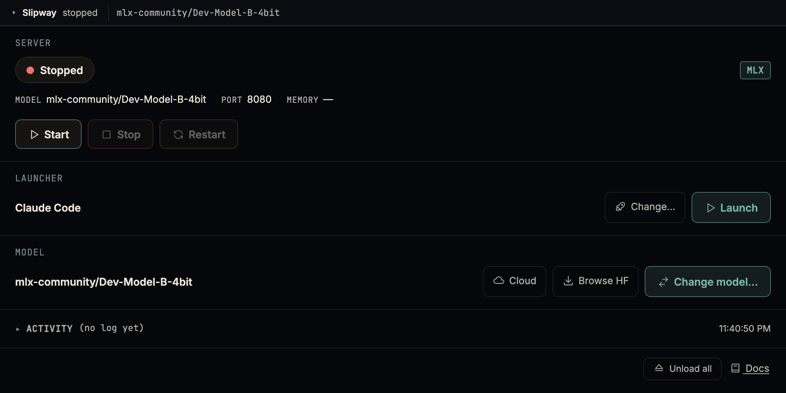

*The recomposed expanded control view (demo-safe: placeholder model, empty log, no paths).
The **collapsed** view — terminals as the page — is deliberately not shipped as a public
shot: on the capture machine it shows the real local runtime and its session names
(real-graph information). The `agents-lens.spec.js` + `slipway-panel.spec.js` e2e cover the
detected / not-detected states and the recomposed layout.*

## 8. Capture — link/video intake + receipt

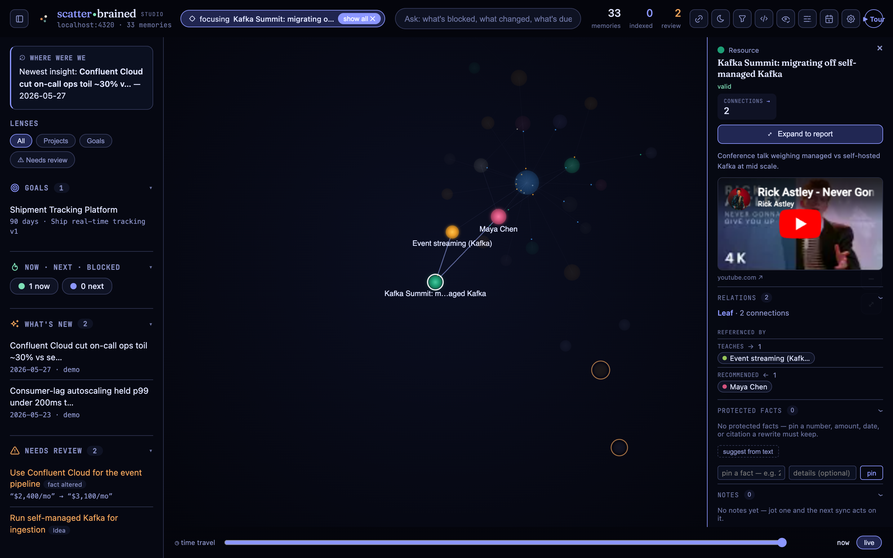

**Usefulness.** Capture (+) on the rail: paste a URL, attach it to the nodes it
informs (fuzzy typeahead + chips), and it lands as a connected `Source` — YouTube
talks render as playable cards. Agent-session capture (Agents lens) shares the same
receipt pattern: toast + fly-to-node, the "it's in the graph now" moment.

## 9. Inline graph editing — relate, don't import/export

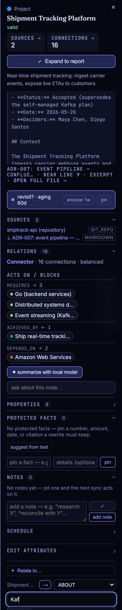

**Usefulness.** The inspector's `Relate to…` writes canonical relationship types in
valid shapes only (the closed vocab), with direction flip and multi-select chips. The
graph stays lintable no matter how fast you wire it.

## 10. Needs review — the attention queue

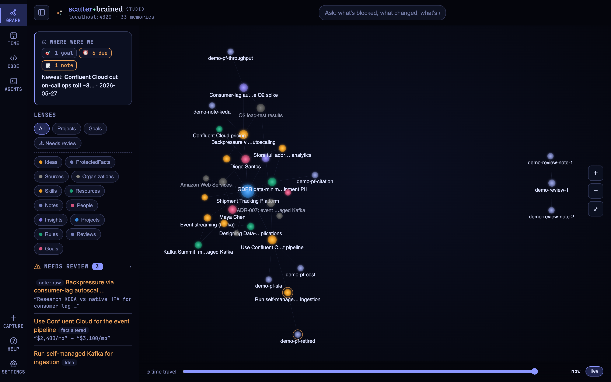

**Usefulness.** Everything that needs a human collects in one dock section: regressed
or stale acceptance criteria, open notes, pending protected-fact changes, renames, low
confidence, superseded, orphans — each row opens its anchor. The count badge reads in
accent when non-zero.

## 10a. Acceptance criteria — regression guardrails

**Usefulness.** Criteria are to *behavior* what protected facts are to *prose*: pinned,
testable expectations ABOUT an Idea/Project that must survive change. The **Acceptance**
section (inspector + report, on Idea/Project or wherever criteria exist; palette:
*Add acceptance criterion*) pins them at design time and shows state chips —
`unverified` → `pass`/`fail`, a pass decaying to `stale` after 14 days
(`lib/criteria.js STALE_DAYS`) — with last-verified dates and evidence. State changes
ONLY via explicit verification events (`POST /api/criterion/verify`, the seam a test
runner or CI can drive); the generic note-state cycle refuses criterion notes. Regressed
and stale criteria surface in the Needs-review dock lane, and the Code lens Review
summary lists the resolved project's criteria as a read-only checklist beside the
verdict — the behavior the change under review must keep.

## 11. Settings, themes, UI size, calm

**Usefulness.** Six themes × light/dark (vars only — every surface, including the
Slipway embed, follows); **UI size S/M/L** scales the whole type/control ramp via
`--ui-scale` (0.9 / 1 / 1.15), persisted and forwarded to the embed; **calm mode**
kills *all* motion (transitions and keyframes) and is auto-bridged from OS
reduced-motion; the loading-animation tier (off/light/full) tames or disables the boot
constellation. All of it is also reachable as palette commands.

## 12. The empty-state system

Every "nothing here" and every failure path renders `lib/empty-state.js`: constellation
motif in the context's ink, a Fraunces one-liner, optional body, at most **one**
action — wired through the command registry, so an empty state can do anything the
palette can. Compact variants inside dock sections and inspector components. No bare
"SOURCE FILE NOT FOUND" strings remain.

---

## Cross-cutting critique

- **Capping leaks.** Several counts derive from a 60-edge cap in `/api/node`; key-facts
  and the chart use uncapped server `COUNT`s, but any new edge-derived metric must
  remember this or it silently under-reports.
- **One visual language now** — the rail, dock, lenses, inspector/report and popovers
  share the token layer, eyebrow recipe, card anatomy and empty-state (SPEC.md §11).
  The remaining third idiom is the canvas itself (its own label/ring painter).
- **LLM-optional, honestly.** `ai-summary`/`ai-qa` stay capability-gated to a local
  runtime; nothing on these screens depends on a model.
- **Data shapes the ceiling.** Thin nodes make thin reports — the tool is only as rich
  as the graph beneath it.

_Captured at 1440×900 @2× against the demo Studio
(`STUDIO_URL=http://localhost:4320 node docs/capture-screens.mjs`
— see `examples/README.md` to bring the demo up). Never capture the public set from a
real graph._
