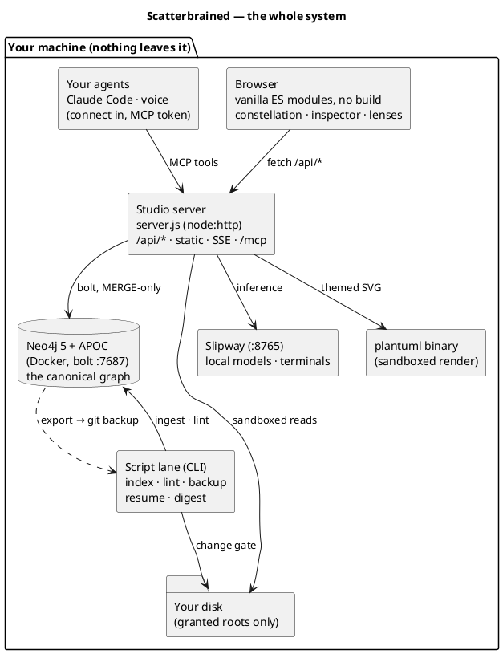

# The system, part by part

Everything Scatterbrained is made of, what each piece does, and what talks to
what. The diagram below is live: it renders through the local PlantUML lane
and re-colors itself when you switch themes.

## The browser app

A plain web app served from `public/`: vanilla ES modules, **no build step,
no framework**. Vendored libraries (force-graph, a markdown parser, a PDF
renderer) live in `public/vendor/` — no CDN, no network fetch at runtime.
Every color is a CSS custom property from the token system, which is how the
whole app — canvas, panels, code, charts, diagrams — re-themes live (see
[Themes](guides/themes.md)).

## The Node server

One process, `server.js`, built on `node:http` with a single real dependency
(`neo4j-driver`). It plays four roles:

- **JSON API** (`/api/*`) — graph reads and MERGE-only writes, the doc trees,
  schedule and criterion writes, capture endpoints, lens queries.
- **Static file server** — the app itself, and the built-in manual you're
  reading.
- **Sandboxed file gateway** — `/api/file` and `/api/raw` read your documents
  live from disk, only inside the [granted roots](guides/document-roots.md),
  size-capped, symlink-resolved.
- **MCP endpoint** (`POST /mcp`) — how [your agents](guides/mcp-and-voice.md)
  drive the Studio, authenticated by a local bearer token.

It also pushes a small SSE stream (`graph-changed`) so open tabs know when
the graph moved under them. The server binds to localhost — it is a personal
tool, not a web service.

## Neo4j — the canonical store

The graph database holds the actual knowledge: typed nodes with natural keys,
relationship edges from a closed vocabulary, `Source` nodes with `INFORMS`
edges for provenance, and **bi-temporal history** — superseded facts get
`valid_until` + `superseded_by` instead of deletion, which is what makes
time-travel and honest audits possible.

Writes are **MERGE-only** (re-running an ingest never duplicates), and a
schema seed applies constraints on first run. The graph is yours: it's a
stock Neo4j 5 you can open in Neo4j Browser (`:7474`) and query directly.

## Docker — one container, optional

Docker exists in this system for exactly one job: running Neo4j. The bundled
`docker-compose.yml` starts `neo4j:5-community` with the APOC plugin and
named volumes for data and logs; `npm start` auto-starts it if nothing is
listening. Already have a Neo4j? Point `NEO4J_URI`/`NEO4J_PASSWORD` at it and
Docker is never touched. The Studio itself is plain Node — no container.

## The script lane — the graph's toolbelt

A set of small CLIs (also wrapped by the `scatterbrained` command) that do
the jobs a UI shouldn't:

- **document-index** — the change gate: hashes every file under your granted
  roots and reports only what's new or changed, so ingestion is cheap and
  deterministic.
- **export / import** — the whole graph serialized deterministically to
  `backups/graph.json` and committed to git. **Git history is the time
  machine**; one file, small diffs.
- **lint** — schema police: vocabulary violations, orphans, expired facts
  still presented, features without acceptance criteria.
- **resume / digest** — the out-of-band readers: "where was I" and "what's
  due", printable from any shell or cron job.
- **supersede** — bi-temporal invalidation done correctly, never a delete.

## The local AI lanes

Three, all optional, all local:

- **Slipway** — the runtime deck embedded in the
  [Agents lens](guides/agents-and-slipway.md): starts/stops local model
  runtimes (Ollama, MLX) and hosts in-browser agent terminals.
- **Inference** — the Studio's assistant resolves whatever is *actually
  loaded* locally; no resident model means an honest "no model", never a
  cloud fallback.
- **MCP** — your own agent (e.g. a Claude Code session) connects **in** to
  the Studio's tools; the Studio never calls out to a model API.

## The diagram lane

PlantUML sources — including the one at the top of this page — render through
a **local `plantuml` binary** in a restricted, stdin-only process; include
directives that reach for the network are rejected before rendering. Rendered
SVGs use sentinel colors that map to CSS variables, so a stored diagram
restyles on every theme switch with zero re-renders. No `plantuml` installed?
The fence degrades to highlighted source — honest fallback, nothing breaks.

## Trust boundaries, in one breath

The server listens on localhost only; file reads live inside home-directory
roots you granted; the graph lives in your Neo4j; backups live in your git;
models run on your hardware; diagrams render in a sandbox. The system has no
outbound lane to lose your data on.
